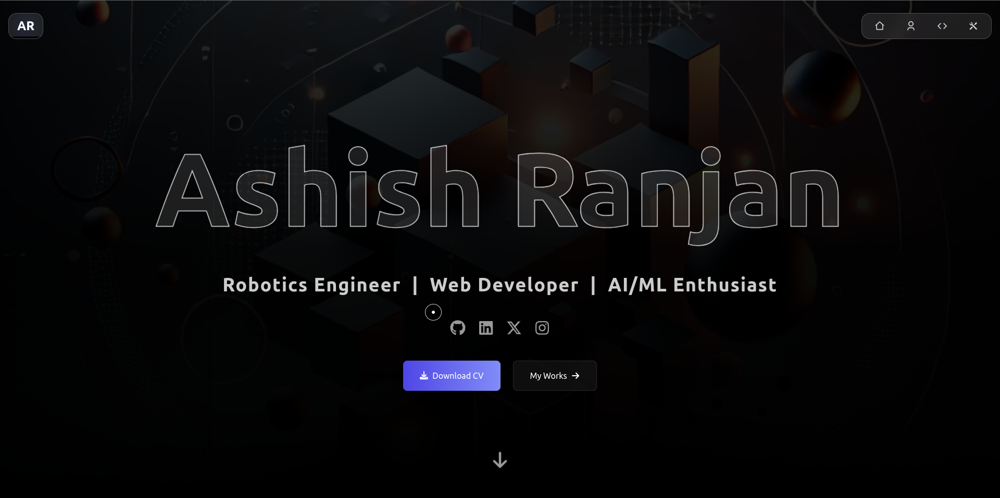
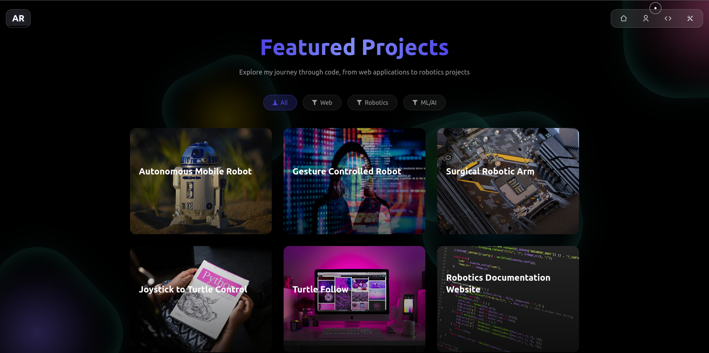

# Portfolio Website

A modern, interactive portfolio website built with React, Vite, and Framer Motion. Features a sleek design with animated UI elements, project showcases, and smooth transitions.

Home Page: 

Projects Page: 


## ✨ Features

- Responsive design that works beautifully across all devices
- Interactive project cards with hover animations and detailed modal views
- Custom mouse follower cursor with context-aware animations
- Smooth scrolling and page transitions
- Glass morphism effects and animated background elements
- Dark mode optimized design

## 🛠️ Built With

- React - Frontend framework
- Vite - Build tool and development server
- Framer Motion - Animation library
- Tailwind CSS - Styling and UI components
- React Icons - Icon components

## 🚀 Getting Started

1. Clone the repository:
   ```bash
   git clone https://github.com/AshishNith/portfolio.git
   ```

2. Install dependencies:
   ```bash
   cd portfolio
   npm install
   ```

3. Start the development server:
   ```bash
   npm run dev
   ```

4. Build for production:
   ```bash
   npm run build
   ```

## 🎨 Customization

1. Update the project data in `src/data/projects.js`
2. Modify styles in `src/index.css` and Tailwind config
3. Add your own images to `src/assets/`
4. Update content in component files as needed

<!-- ## 📝 License

This project is licensed under the MIT License - see the [LICENSE](LICENSE) file for details. -->

## 🙏 Acknowledgments

- Design inspiration from modern portfolio trends
- Framer Motion for amazing animation capabilities 
- The React and Vite communities for excellent documentation
